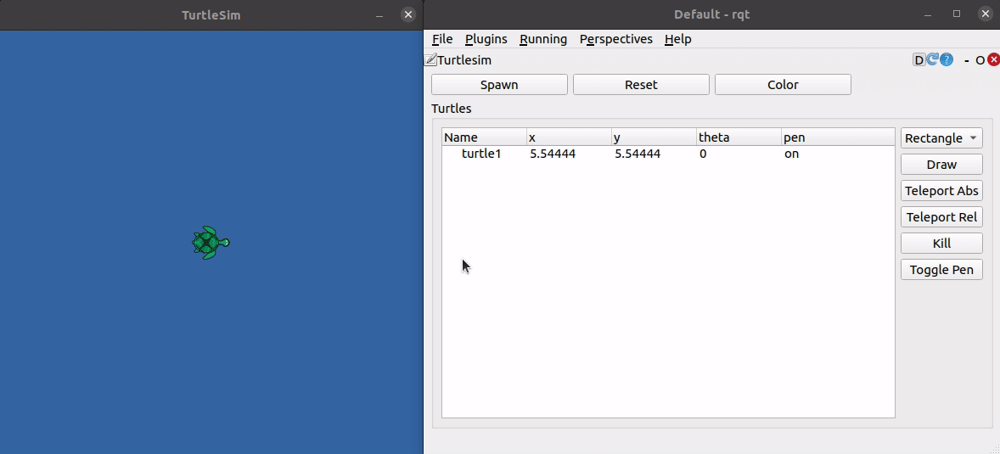

# rqt-turtle

[`rqt`](http://wiki.ros.org/rqt) plugin for ROS (Noetic) to control turtles in turtlesim.

To learn how the package was created, please read the [documentation](https://fjp.at/ros/turtle-pong).

The video below gives more insights on what is currently implemented:

## Launch

To run the plugin make sure it is installed in your ros workspace and execute `rqt`.
From the `Plugins` menu select `Robot Tools->TurtleSim`.

## Dependencies

The following dependencies are only required if you would like to contribute addons to this project.

- [Qt 5](https://wiki.qt.io/Install_Qt_5_on_Ubuntu): `sudo apt install qt5-default qtcreator`
- OpenCV: Install ubuntu package `sudo apt install libopencv-dev` or install a specific/latest version [from source](https://docs.opencv.org/trunk/d7/d9f/tutorial_linux_install.html)
